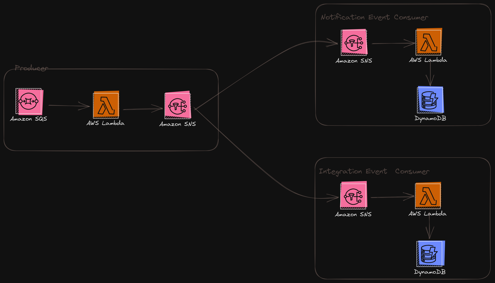

# Intro

This folder holds all the code samples supporting the  Event model standards study

## Why defining standards on our event models ?

Defining event models standards for cross cells as well as intra cell communication can provide many benefits as we are building new WL capabilities. By implementing these standards we can greatly improve:

- Discovrability and documentation of EDAs
- The way event consumers are processing events (e.g. Event Filtering)
- Observability of distributed systems

## Samples schema 

